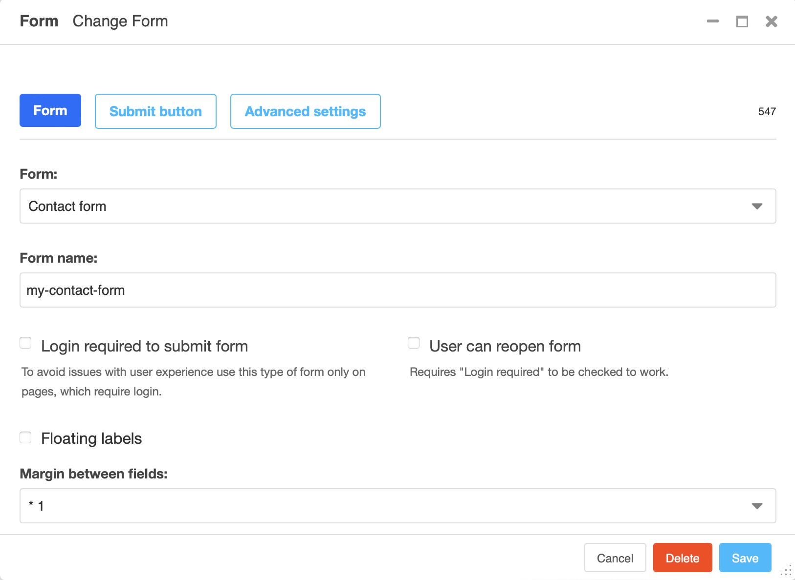

Tutorial: build your first form
###############################

In this tutorial you add a contact form to a django CMS page, let it store what
visitors send, and read the first submission in the admin. It assumes a working
django CMS project you can add pages to.

At the end you will have a form built entirely from plugins - no form class, no
view, no URL of your own.

Install the app
===============

Install the package into the environment of your project:

.. code-block:: bash

   pip install djangocms-form-builder

Add it to ``INSTALLED_APPS``:

.. code-block:: python

   INSTALLED_APPS = [
       ...
       "djangocms_form_builder",
   ]

If your project also uses `djangocms-frontend
<https://github.com/django-cms/djangocms-frontend>`_, add
``djangocms_form_builder`` **after** it.

Create the database tables:

.. code-block:: bash

   python manage.py migrate

You do **not** have to add anything to your ``urls.py``: when the app is ready
it prepends its own URLs under the ``@form-builder/`` prefix to your root
URLconf. Submissions are sent there.

Two things your page template needs, both of which a standard django CMS
project already has:

* ```` from `django-sekizai
  <https://github.com/django-cms/django-sekizai>`_ - the form's JavaScript is
  added to the ``js`` block. Without it the form is rendered but never
  submitted.
* Bootstrap 5 CSS - the templates that ship with this package render Bootstrap
  5 markup and classes.

Create the form
===============

A form is an object of its own: you build it once and then show it on as many
pages as you like. Open **Forms** in the toolbar's site menu (or go to
**Form builder** → **Forms** in the admin) and add a form.

**Name**
   What editors see when they pick this form, for example ``Contact form``.

**Form identifier**
   A slug, for example ``contact``. Submissions are stored under this name, so
   pick one you will recognise in the admin - and one you will not want to
   change later, because changing it separates new submissions from the ones
   already collected.

Save. You are now looking at the form editor: the form as a visitor will see
it, with django CMS' structure board to build it in.

Add the fields
==============

Switch to the structure board and add three field plugins from the **Forms**
category into the form's placeholder, in this order:

#. **Text** - label ``Your name``, field name ``name``, *Required* ticked.
#. **Email** - label ``Your email``, field name ``email``, *Required* ticked.
#. **Textarea** - label ``Message``, field name ``message``, *Required*
   ticked.

Every field plugin asks for the same four things: the **Label** shown to the
visitor, the internal **Field name**, whether the field is **Required**, and an
optional **Placeholder** and **Help text**. The field name has to be a slug -
letters, digits, hyphens and underscores - because it becomes the key the
submitted value is stored under.

You do not need to add a **Submit button** plugin: a form without one is
rendered with a default submit button labelled *Submit*. Add the plugin when
you want a different caption or button style, and place it where the button
should appear.

Fields are not the only thing you can put in a form. Any other plugin works
too - a text plugin for an introduction, a grid row to put two fields side by
side - and the fields are found wherever they sit.

.. note::

   On a site with more than one language, build the form in each of them. A
   form itself has no language - one form, one identifier, one set of actions
   - but its plugins do, which is how labels get translated. A form only built
   in English renders nothing on a German page.

Say what happens to a submission
================================

A form that nobody does anything with is not much use. Open **Form settings**
in the toolbar's **Form** menu, expand the **Actions** section and tick **Save
form submission**. Save.

The same dialog holds the rest of the form's behaviour: whether visitors have
to be logged in, whether they may reopen their submission, the layout options,
and the captcha if you have one installed.

If your project uses `djangocms-versioning
<https://github.com/django-cms/djangocms-versioning>`_, publish the form now.
Visitors always get the published version of a form, never the draft you are
working on.

Put the form on a page
======================

Open a page in the structure board and add the **Form** plugin from the
**Forms** category into a placeholder. Pick the form you just built, save, and
publish the page.

The plugin is only the placement. Everything about the form - its fields, its
actions, its layout - stays with the form object, so you can put the same form
on a second page without building it again, and changing it once changes it
everywhere.

Submit the form
===============

Open the published page and send the form. If everything is wired up, the page
does not reload: the submission is sent in the background and the page reloads
only after the submission was accepted.

If instead nothing happens when you press the button, the form's JavaScript was
not loaded - check that your page template renders the sekizai ``js`` block.

Read the submission
===================

In the Django admin, open **Form builder** → **Form entries**. Your submission
is listed under the form identifier you chose, with the time it arrived and -
for a form that requires login - the user who sent it.

Open the entry to see the submitted values. Entries cannot be added by hand,
only viewed, edited and deleted.

Where to go next
================

The form you just built is public, which means it will be found by bots. Before
you put one on a live site:

* protect it - see :doc:`../how-to/add-a-captcha`;
* decide how long you keep submissions - see
  :doc:`../how-to/prune-form-entries`;
* read :doc:`../explanation/security` for what the package does and does not
  do for you.

To do something other than storing a submission - mailing it, redirecting,
running your own code - see :doc:`../reference/actions-api` and
:doc:`../how-to/write-an-action`.

If you are upgrading a project whose forms were built below the form plugin,
see :doc:`../how-to/convert-a-form-plugin`.
